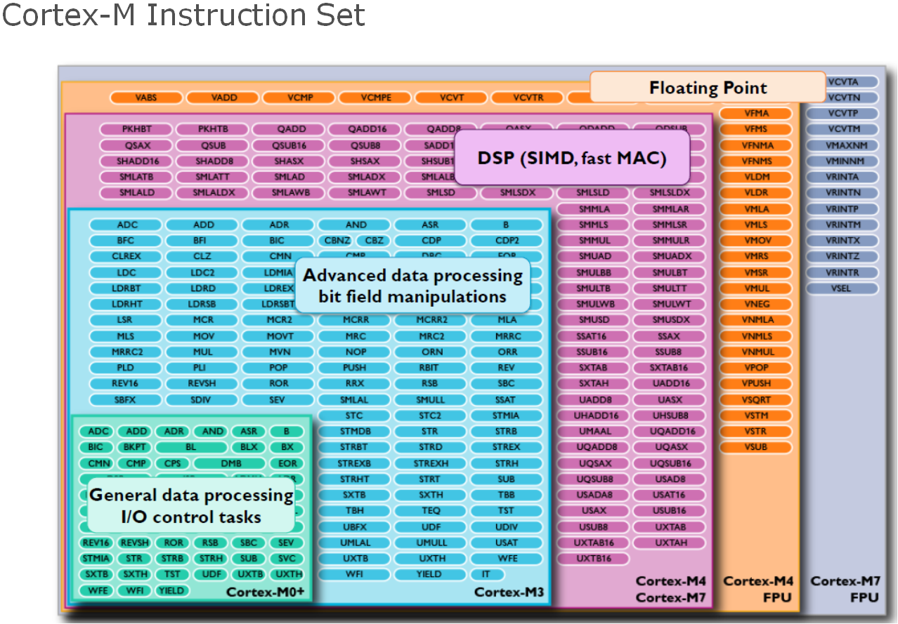

# GNU ARM Assembler

## Toolchain:
[arm-none-eabi-*](https://developer.arm.com/downloads/-/arm-gnu-toolchain-downloads) - is a community supported [GNU Binutils](https://en.wikipedia.org/wiki/GNU_Binutils) for Arm based CPUs:
- `arm-none-eabi-as` - GNU ASM compiler converts text based instructions into bit code:
  - `*.s` - inputs assembly file code with [GNU ARM Assembler](https://developer.arm.com/documentation/den0013/d/Introduction-to-Assembly-Language/Introduction-to-the-GNU-Assembler?lang=en) syntax.
  - `*.o` - outputs converted assembly code into bit code called [object file](https://en.wikipedia.org/wiki/Object_file).
- `arm-none-eabi-ld` - GNU linker which take :
  - `*.o` - lists of input object files.
  - `*.ld` - inputs [linker](https://en.wikipedia.org/wiki/Linker_(computing)) MCU mamory map and asm sections script.
  - `*.elf` - outputs [Executable and Linkable Format](https://en.wikipedia.org/wiki/Executable_and_Linkable_Format).
- `arm-none-eabi-objcopy` - converting ELF into more hardware dependend binary format which is ready for flashing:
  - `*.elf` - inputs file.
  - `*.bin` - final binnary which ready to be flashed into MCU flash.
- `st-flash` - ST-Link flashing tool.
- `arm-none-eabi-gdb` - [GNU](https://en.wikipedia.org/wiki/GNU_Debugger):
  - `openocd` - open source GDB server supports a variety of JTAG probes.

### arm-none-eabi
- arm - Advanced RISC Machine
- none - bare-metal / none platform
- eabi - Embedded Application Binary Interface

### arm-linux-gnueabi
- arm - Advanced RISC Machine
- linux - for linux platform
- gnueabi - GNU Embedded Application Binary Interface

## Syntax:

``` armasm
.assembler_directives

.include "file.s"

.section .name

.equ const, 0x12

.global label

label: 
    instruction @ comment
    instruction // comment
    #if condition
    instruction // do
    #else
    instruction // do
    #endif
    mov r1, #0x01 // Move 0x01 into r1 register

.end

```

### Sections:
- `.text` - section, also known as the "code section," contains the executable code of your program. It includes the actual machine instructions that the CPU will execute. This section is typically marked as read-only, as code should not be modified during program execution.
- `.data` - section holds initialized global and static variables that have a specific initial value. These variables are stored in RAM, and the values are copied from the program's binary image to RAM when the program starts. Any modifications to these variables during program execution will be reflected in RAM but not in the original program image.
- `.rodata` - section contains read-only data, such as constant strings and other immutable values. It's marked as read-only to prevent accidental modification of these values during program execution. Accessing data in this section is usually for reading, not writing.
- `.bss` - (Block Started by Symbol) section is reserved for uninitialized global and static variables. Unlike the .data section, which stores initialized variables, the .bss section does not store initial values. Instead, it allocates memory for these variables but initializes them to zero by default. This section helps reduce the size of the binary file because it doesn't need to store initial values for these variables.

### Instruction sets:


## Source files:
 - `.s` and `.S` - Assembly language source code files, with `.S` often indicating preprocessor directives.
 - `.asm` - Assembly language source code files.
 - `.i` - Preprocessed source code files used for debugging and analysis.